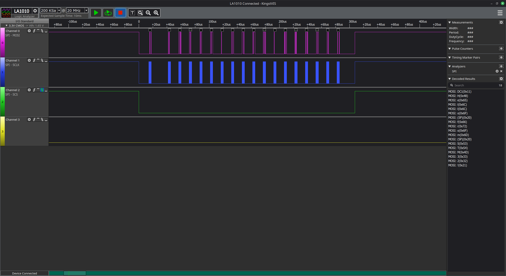
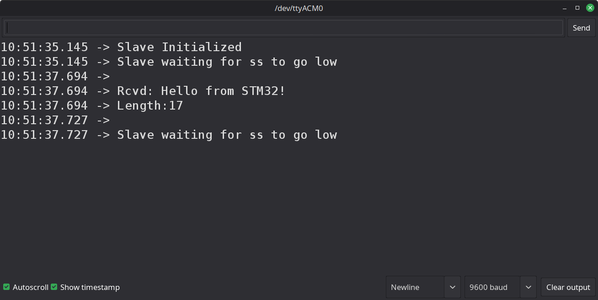
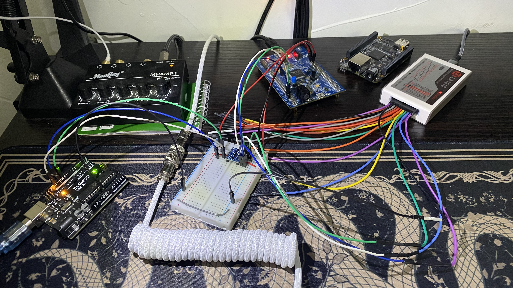

# 006 SPI Arduino TX Demo

This demo sends a length byte followed by a payload string to an Arduino SPI slave from a STM32F407 master.

## Files
- **STM32 Master File**: `Src/006SPI_arduino_TX_test.c`
- **Arduino Slave File**: `arduino/006SPI_arduino_RX/006SPI_arduino_RX.ino`

## Images

### Logic Analyzer Sample

- The decoded data is shown on the bottom right panel titled *Decoded Results*.

### Arduino Serial Terminal Output

### Hardware Setup

- Uses bidirectional level shifter to communicate between 3.3V master (STM32) and 5.1V slave (Arduino).
- Logic analyzer snoops on the MOSI, SCLK, and NSS lines.