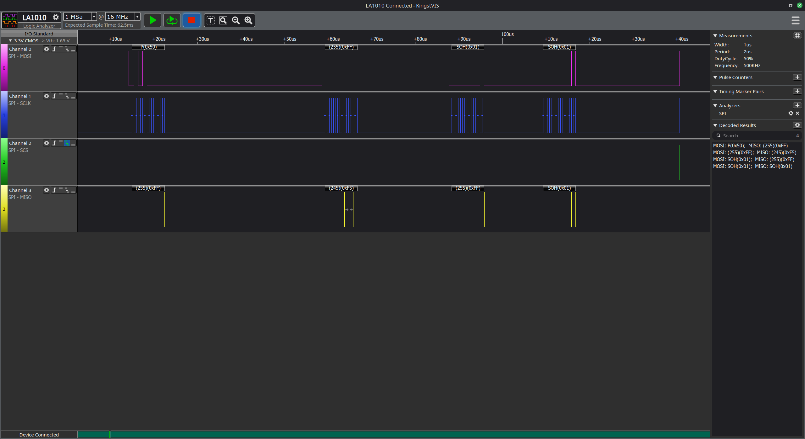
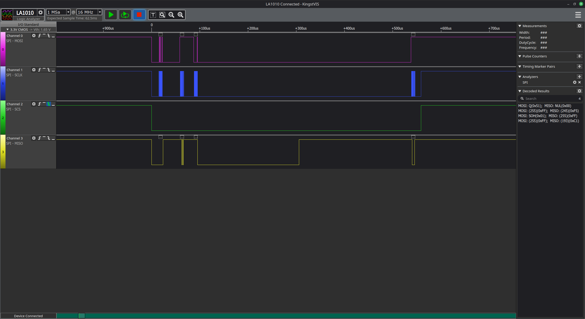
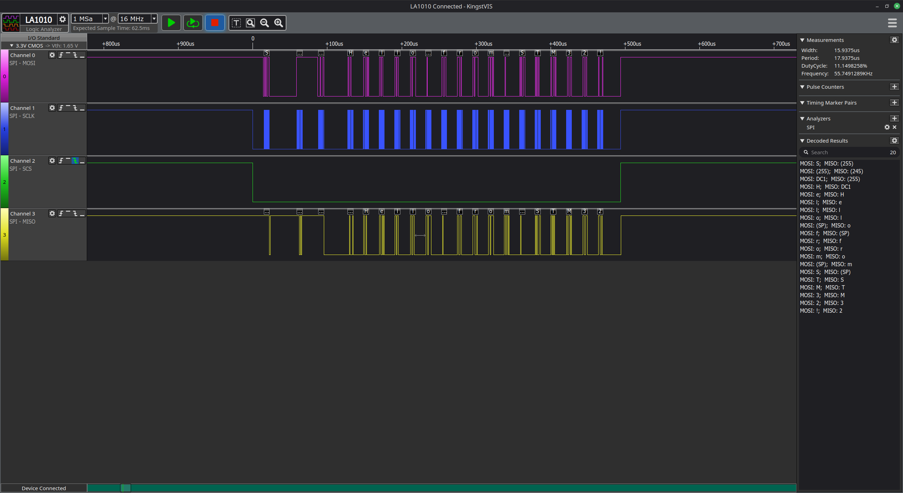
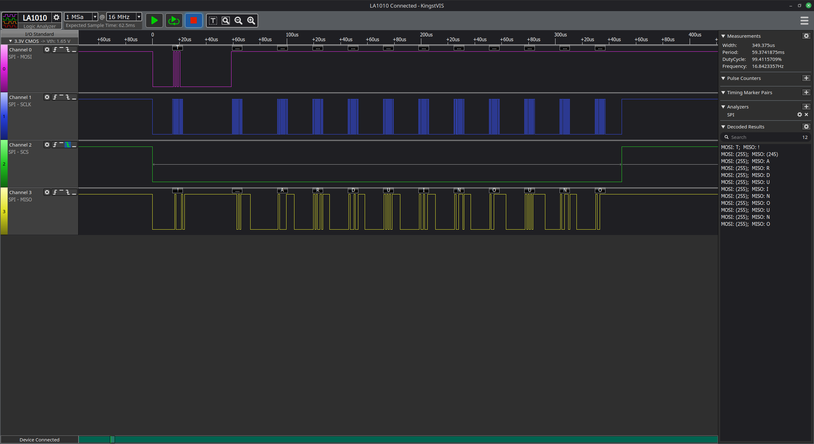
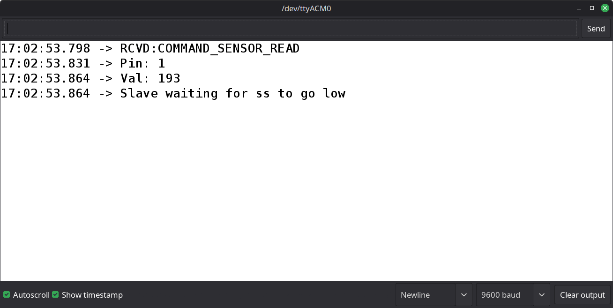
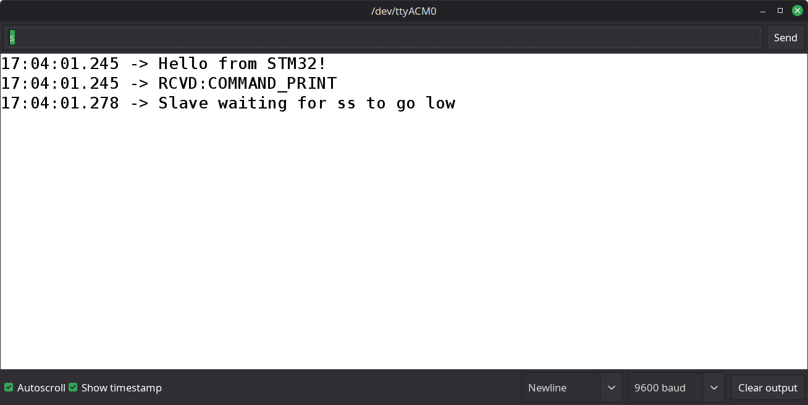
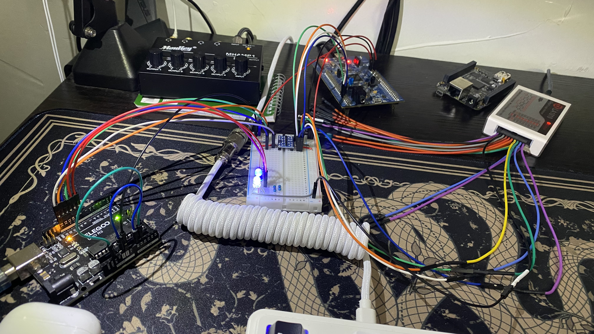

# 007 Arduino CMD Demo

### Overview
This demo makes use of full-duplex SPI communication using the custom SPI driver to send commands to an Arduino Uno slave from an STM32F407 master.

The supported commands include:
- `CMD_LED_CTL`: This command takes a pin number and value as arguments and either enables or disables an LED connected to the Arduino at the given pin.
- `CMD_LED_READ`: This command takes a pin number as an argument and the Arduino slave returns the status of the LED at that pin (ON/OFF).
- `CMD_SENSOR_READ`: This command requests the ADC value of a given analog pin on the Arduino slave.
- `CMD_PRINT`: This command sends a byte buffer to the Arduino, which then prints the data to its serial terminal.
- `CMD_ID_READ`: This command requests the ID of the Arduino slave.

## Wiring

The hardware required for this demo includes:
- Arduino Uno board.
- STM32F407G Discovery board.
- 3.3V/5V bi-directional level shifter.
- 2 LEDs & Resistors.
- Jumper wires.

1. Connect the level shifter to 3.3V and 5V, as well as a common ground.
2. `12 -> PB14`: Connect the **MISO** of the Arduino (Pin 12) to the **MISO** of SPI2 on the STM32 (PB14) through the level shifter.
3. `11 -> PB15`: Connect the **MOSI** of the Arduino (Pin 11) to the **MOSI** of SPI2 on the STM32 (PB15) through the level shifter.
4. `13 -> PB13`: Connect the **SCLK** of the Arduino (Pin 13) to the **SCLK** of SPI2 on the STM32 (PB13) through the level shifter.
5. `10 -> PB12`: Connect the **NSS** of the Arduino (Pin 10) to the **NSS** of SPI2 on the STM32 (PB12) through the level shifter.
6. Connect two LEDs to pin 9 and 8 of the Arduino through current-limiting resistors.

## Files
- **STM32 Master File**: `Src/007SPI_arduino_CMD.c`
- **Arduino Slave File**: `arduino/007_SPI_arduino_CMD/007_SPI_arduino_CMD.ino`

## Images

### Logic Analyzer Samples
#### CMD_LED_CTL Analyzer Output

#### CMD_SENSOR_READ Analyzer Output

- *Note that the master delays for some time before requesting the sensor value since an analog read by the Arduino takes a non-negligible amount of time.*
- *The sensor read output was `193`, which is the final byte transmitted on the MISO line by the Arduino.*

#### CMD_PRINT Analyzer Output

#### CMD_ID_READ Analyzer Output

### Arduino Serial Terminal Output
#### CMD_SENSOR_READ Serial Terminal

#### CMD_PRINT Serial Terminal

### Hardware Setup

- The blue LED is connected to pin `9` of the Arduino. The white LED is connected to pin `8`.
- Analog pin `A0` is connected to `GND`, while analog pin `A1` is connected to `3.3V`.
