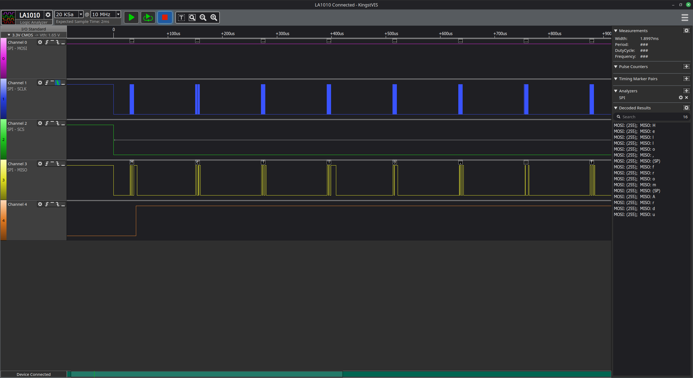
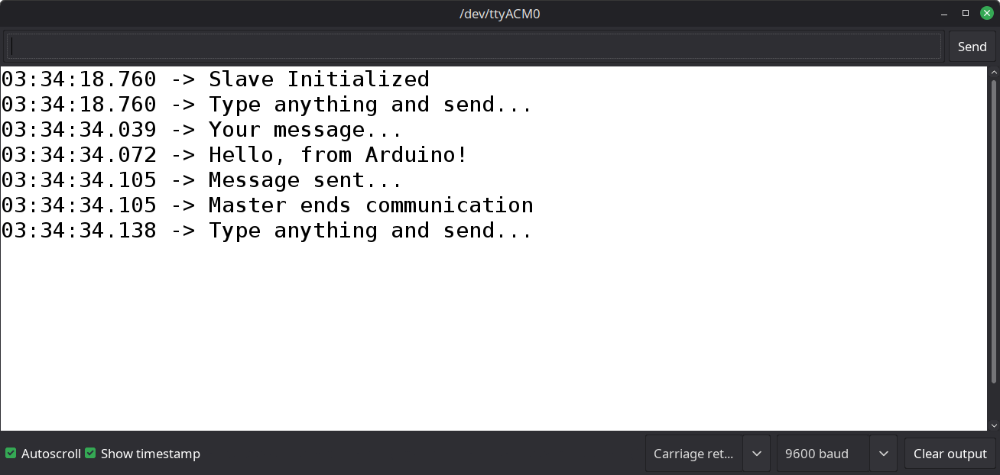
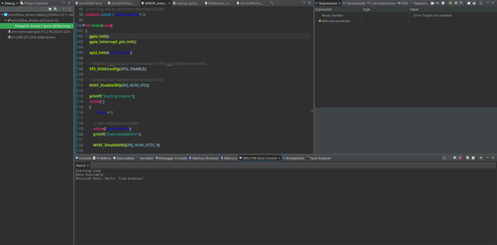
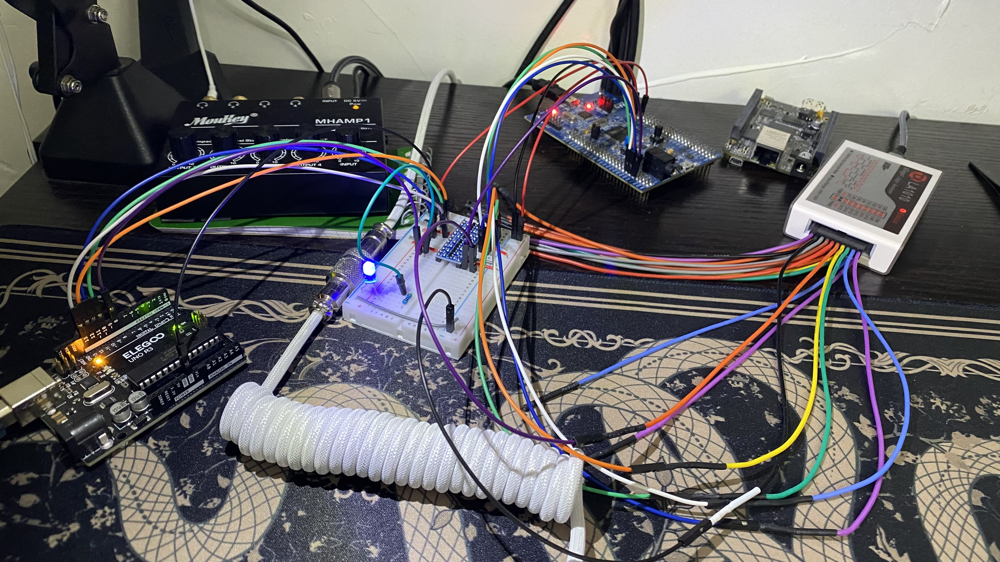

# 008 SPI-Arduino Interrupt Demo

### Overview

This demo makes use of the interrupt-driven SPI capabilities of the driver by having the STM32 SPI-master receive a variable-length message from an Arduino Uno.

In this demo, the master configures a GPIO pin as an interrupt pin and enables the IRQ number of the SPI2 peripheral. Then, the master spins waiting for the Arduino to pull the external interrupt line low, indicating that a message is ready to be sent (*this mimics actual work that the master can be doing in the meantime*). The ISR triggered by the external interrupt asserts a flag that the user application uses to determine that a message is ready. The master then uses the non-blocking SPI APIs made available by the driver to read the data byte-by-byte. Once the final byte (*'\0'*) is received, the master prints the message to a terminal (*via SWV*) and returns to the beginning of the loop.

*Note that this demo effectively performs the receive in a blocking manner since it waits for each receive operation to complete before continuing. This demo is simply meant to demonstrate the functionality of the non-blocking APIs.*

## Files
- **STM32 Master File**: `Src/008SPI_arduino_interrupt.c`
- **Arduino Slave File**: `arduino/008_SPI_arduino_interrupt/008_SPI_arduino_interrupt.ino`

## Wiring
The hardware required to replicate this demo includes:
- Arduino Uno Board
- STM32F407G Discovery Board
- Breadboard
- 3.3V/5V bi-directional level shifter
- Jumper Wires
- Logic Analyzer (*optional*)

1. Connect the level-shifter to 3.3V and 5V (*from the STM32 board*), and a common ground (*from the Arduino **and** STM32 board*).
2. `12 -> PB14`: Connect the **MISO** of the Arduino (Pin 12) to the **MISO** of SPI2 on the STM32 (PB14) through the level shifter.
3. `11 -> PB15`: Connect the **MOSI** of the Arduino (Pin 11) to the **MOSI** of SPI2 on the STM32 (PB15) through the level shifter.
4. `13 -> PB13`: Connect the **SCLK** of the Arduino (Pin 13) to the **SCLK** of SPI2 on the STM32 (PB13) through the level shifter.
5. `10 -> PB12`: Connect the **NSS** of the Arduino (Pin 10) to the **NSS** of SPI2 on the STM32 (PB12) through the level shifter.
6. `8 -> PD9`: Connect the configured interrupt delivery line of the Arduino (Pin 8) to the GPIO interrupt input line on the STM32 (PD9) through the level-shifter.
7. (*optional*) Connect the logic analyzer to the breadboard rows to snoop data.

## Images

### Logic Analyzer Sample

- *The decoded data can be seen in the bottom-right panel.*

### Arduino Serial Terminal Output

### STM32F407 SWV Output

- *The SWV output can be seen in the bottom-middle panel.*

### Hardware Setup

- *The LED hangs off the interrupt line to visibly display the status of the interrupt line.*